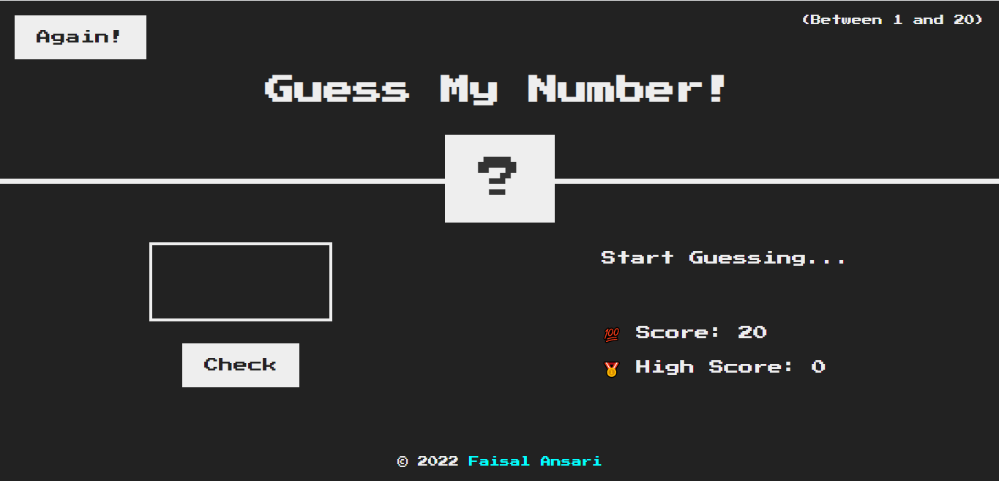
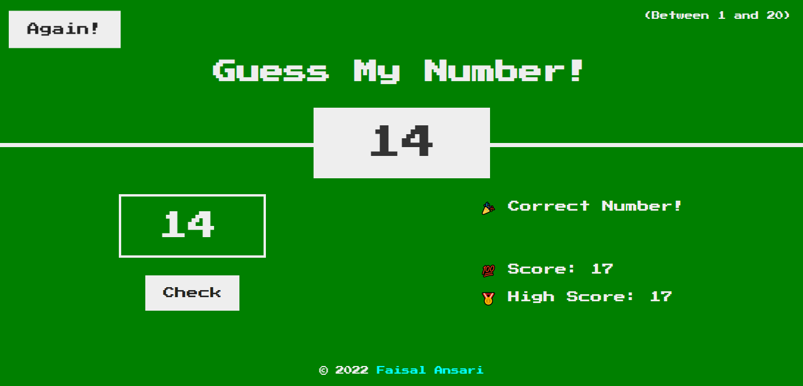
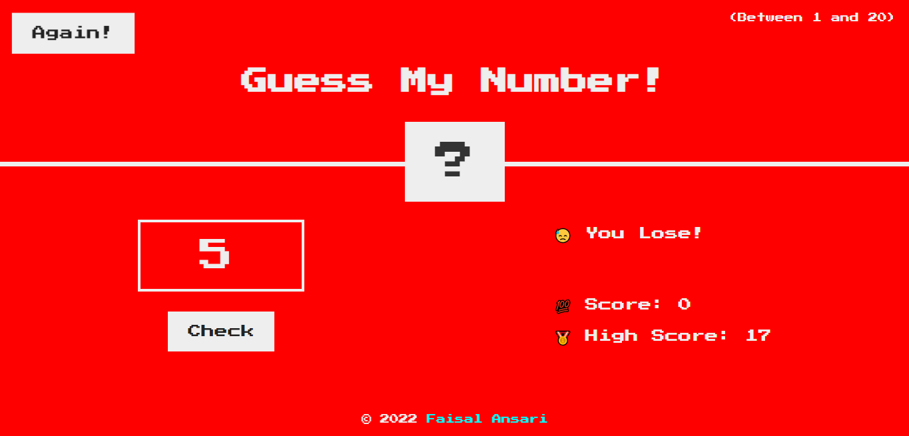

# Guess My Number - JavaScript Game

GuessMyNumber is a game which is developed using HTML, CSS and JavaScript. This is a small JavaScript project for beginners which includes DOM manipulation.

## About this Game

This is a guessing game in which the user has to guess the correct number between 1 and 20 (including both).

Initially the score is 20 and as the user guesses the wrong number, the score gets reduced by 1. Upon successful guess, the window will turn green and the current score will be added to highscore.

The user can play this game again (by clicking on 'Again!' button). If the user scores more than the high score, then high score will get updated.

If the user can't guess the right number in 20 attempts, then he will lose and the window will turn red.

This project is hosted live on netlify with a custom domain name, which you can checkout and play this game by following link:

[guessmynumber.faisalansari.me](https://guessmynumber.faisalansari.me/)
